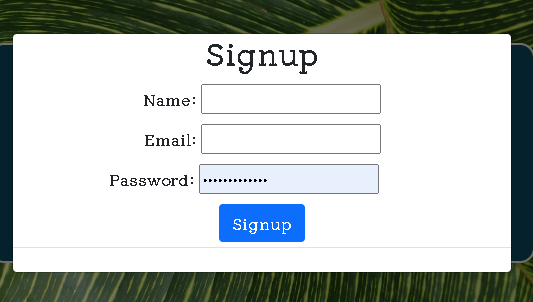
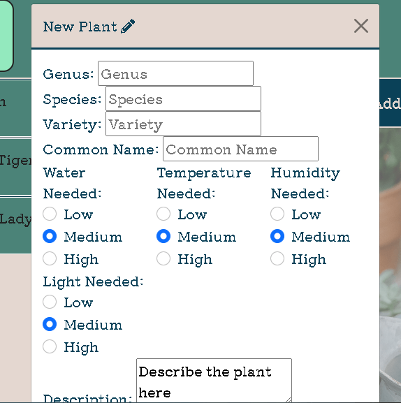

# Plantsy -- The Social Community for Plant Lovers

URL: https://limitless-cove-25591.herokuapp.com/

Git Repository: https://github.com/mradamhorn/plantsy

## Table of Contents
- [Description](#description)
- [Usage](#usage)
- [Future Development](#future_development)
- [Screenshots](#screen_shots)
- [Contributors](#contributors)
- [Testing](#testing)
- [Questions](#questions)
- [License](#license)

---

## Description

Plantsy is an interactive site where users can get, store, and modify information about plants they own. Features currently in development will allow users to share user-generated content with other users. 

We envision Plantsy serving as a comprehensive hub for new and experienced gardeners to find and share information about plant varieties, keep track of their personal plant collections, store individualized care requirements, and connect with other gardeners.

Plantsy is in development. A basic, functional framework is currently deployed on Heroku.

---

## Usage

Visitors and users may view the master list of plant varieties by clicking "Plants". Varieties, listed by scientific and common name, appear on left as entries which may be expanded to show basic care information and a link to the full plant profile. PLant profiles include a photo and more detailed care information. Logged-in users will see the option to add the plant to their collection.

New Users may create an account by following the "Login" link in the top right corner and selecting "sign-up." They will be prompted to enter a name, email, and password.

Once logged-in, users are able to view or modify their personal plant collection ("My Plants" --/users), view the profiles and collections of other gardeners ("Gardeners" --/gardeners), and add plants from the master list of varieties ("Plants" --/plants) to their collection by following the "Add Plant" link on the plant profile. Once added, users may modify or add information to the plant profile by clicking the "Edit" button. From their personal page ("My Plants" --/users), users may generate entirely new plant profiles by clicking "Add New Plant" or delete plants from their collection by clicking "Delete Plant."

---

## Future_Development

- Import comprehensive plant information from existing API or Database and implement search/sort functionality

- Incorporate weather API and timer to generate individualized weather-appropriate watering schedule

- Add social networking functionality to allow users to select friends, share and comment

- Enable users to upload personal photos of their plants

- Add functionality giving users greater control of what information is stored in their plant profiles and how information is displayed

- Add admin review functionality so approved user-generated plant profiles may be added to /plants and made available to all users

---

## Screen_Shots

### login page

### register page

### logged-in view

### add new plant

---

## Contributors
Developed by [Adam Horn](https://github.com/mradamhorn), [Kiel Sprague](https://github.com/Aereisdin), [Leslie Williams](https://github.com/Sesdesoir), and [Skyler Blakeslee](https://github.com/skyler-blakeslee).

---

## Testing

---

## Questions

---

## License
