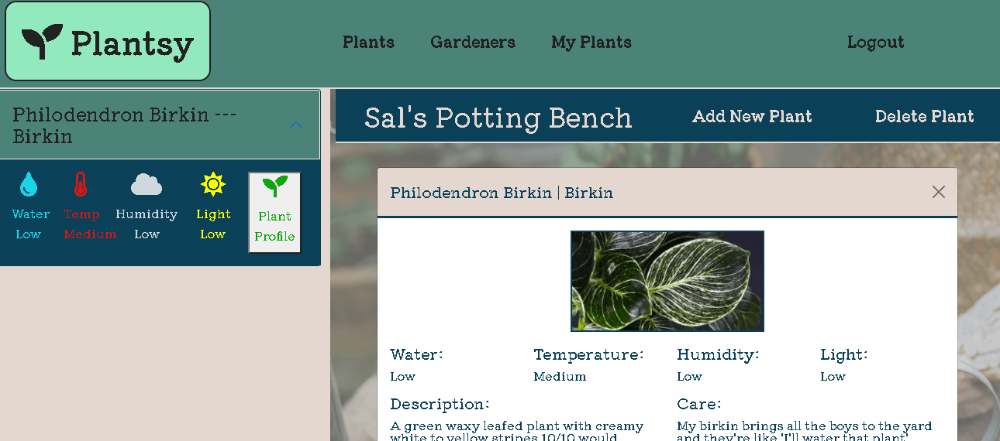

# Plantsy -- The Social Community for Plant Lovers

## Table of Contents
- [Description](#description)
- [Installation](#installation)
- [Usage](#usage)
- [Screenshots](#screenshots)
- [Contributors](#contributors)
- [Testing](#testing)
- [Questions](#questions)
- [License](#license)

---

## Description

Plant Care API

Plantsy is an interactive site where users can get, store, and modify information about plants they own. In future versions, users will be able to share user-generated data with other users. 

Standardized plant entries can be found in /plants. In future versions, users will be able to easily add these entries as a template to their "My Plants" collection with the option to modify parameters at start.

---

## Installation
  

---

## Usage
 

---

# Screen Shots

## login page

## register page

## logged-in view

## Contributors
Developed by [Adam Horn](https://github.com/mradamhorn), [Kiel Sprague](https://github.com/Aereisdin), [Leslie Williams](https://github.com/Sesdesoir), and [Skyler Blakeslee](https://github.com/skyler-blakeslee).

---

## Testing

---

## Questions

---

## License
